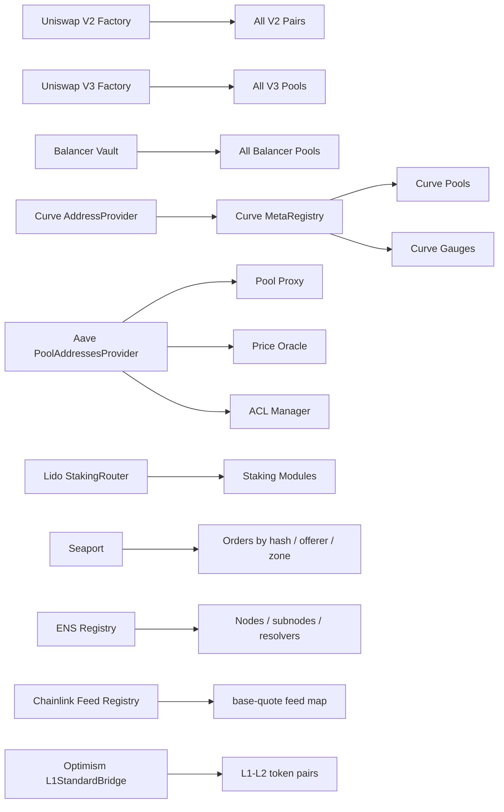

# Ethereum Mainnet Protocol Hubs for Event-Centric Discovery

## Executive summary

For an event-indexing tool, the most commercially valuable Ethereum mainnet “hub” contracts fall into four patterns. First, **factories** such as Uniswap V2/V3 and Sushi V2 emit child-creation events that reveal the full universe of pools or pairs, solving a key-space discovery problem that storage calls alone do not solve. Second, **centralized vaults and routers** such as the Balancer Vault and Seaport concentrate lifecycle events for many underlying objects, making them unusually efficient roots for indexers. Third, **registries** such as Curve’s AddressProvider and MetaRegistry, Aave’s PoolAddressesProvider, ENS Registry, Lido’s StakingRouter, and Chainlink’s Feed Registry expose otherwise scattered relationships among contracts, modules, feeds, or names. Fourth, **bridge hubs** such as Optimism’s L1StandardBridge emit the token-pair and flow history needed to reconstruct cross-layer activity and discover bridged asset mappings over time.

For an event-query product, the best opportunities are not usually “read current state from the hub.” They are “use the hub to discover all child objects, then build event-sourced views over those objects.” Factories reveal all pools; registries reveal all modules, feeds, or names; bridge and marketplace hubs reveal all orders, token-pairs, or cross-domain flows that became relevant onchain. That is where alerting, due diligence, trading surveillance, risk monitoring, and operational intelligence become hard to replace with ordinary contract calls.

## Summary table

| Hub | Address | One-line data revealed | Source |
|---|---|---|---|
| Uniswap V2 Factory | `0x5C69bEe701ef814a2B6a3EDD4B1652CB9cc5aA6f` | Canonical list of all V2 pairs via `PairCreated`, `allPairs`, `getPair` |  |
| Uniswap V3 Factory | `0x1F98431c8aD98523631AE4a59f267346ea31F984` | Canonical set of V3 pools and fee tiers via `PoolCreated`, `getPool` | |
| Sushi V2 Factory | `0xC0AEe478e3658e2610c5F7A4A2E1777Ce9e4f2Ac` | Sushi pair graph on mainnet; V2-style pair discovery root |  |
| Balancer Vault | `0xBA12222222228d8Ba445958a75a0704d566BF2C8` | All Balancer pools, token sets, swaps, joins/exits, flash loans | |
| Curve AddressProvider | `0x5ffe7FB82894076ECB99A30D6A32e969e6e35E98` | Root registry of Curve registries/factories and their version history |  |
| Curve MetaRegistry | `0xF98B45FA17DE75FB1aD0e7aFD971b0ca00e379fC` | Aggregated onchain map of Curve pools, gauges, LP tokens, coin-pairs |  |
| Aave V3 PoolAddressesProvider | `0x2f39d218133AFaB8F2B819B1066c7E434Ad94E9e` | Historical/current pointers to Pool, Configurator, Oracle, ACL, Sentinel |  |
| Lido StakingRouter | `0xFdDf38947aFB03C621C71b06C9C70bce73f12999` | Registry of staking modules, router-level module summaries and allocation rules |  |
| OpenSea Seaport 1.6 | `0x0000000000000068F116a894984e2DB1123eB395` | Executed, cancelled, validated, and matched order history |  |
| ENS Registry | `0x00000000000C2E074eC69A0dFb2997BA6C7d2e1e` | Ownership, resolver, TTL, and subdomain relationship graph |  |
| Chainlink Feed Registry | `0x47Fb2585D2C56Fe188D0E6ec628a38b74fCeeeDf` | Canonical mapping from `(base, quote)` pairs to feeds and phase history | |
| Optimism L1StandardBridgeProxy | `0x99C9fc46f92E8a1c0deC1b1747d010903E884bE1` | Bridge token-pair discovery plus deposit/withdraw history to OP Mainnet |  |

## Relationship map

The key implementation pattern is to treat the hub as the **discovery root** and child contracts as the **event ledger**. A factory gives you the object universe; downstream pools or pairs give you the user-level state transitions. A registry gives you the canonical relationship graph; downstream module, feed, or bridge messages give you the live operational history.

## High-value hub entries

**Uniswap V2 Factory — full V2 pair universe discovery.**
**Chain:** Ethereum mainnet. **Address:** `0x5C69bEe701ef814a2B6a3EDD4B1652CB9cc5aA6f`. **Contract / role:** `UniswapV2Factory`, the canonical pair factory. **Key data:** `event PairCreated(address indexed token0, address indexed token1, address pair, uint)` plus `getPair(tokenA, tokenB)`, `allPairs(uint)`, and `allPairsLength()`. **What it discovers:** the complete set of V2 pairs and the creation order of those pairs, which you can then join to downstream pair `Sync`, `Swap`, `Mint`, and `Burn` logs.

**Commercial questions:** Which newly created pairs against WETH or USDC became active fastest; which deployers repeatedly create pairs later associated with rugs or wash-trading; which dormant pairs suddenly reactivated after long inactivity; which sectors or token issuers are clustering around the same pair-creation factories. **Why it matters:** pair creation is the earliest reliable signal that a token has become routable in a canonical AMM venue. **Limitations:** the factory alone does not contain swap/liquidity state; you must follow child pair addresses. **Representative links:** official Uniswap factory docs and verified Etherscan page.

**Uniswap V3 Factory — canonical V3 pool and fee-tier graph.**
**Chain:** Ethereum mainnet. **Address:** `0x1F98431c8aD98523631AE4a59f267346ea31F984`. **Contract / role:** `UniswapV3Factory`, the root for all V3 pools. **Key data:** `OwnerChanged(oldOwner,newOwner)`, `PoolCreated(token0,token1,fee,tickSpacing,pool)`, `FeeAmountEnabled(fee,tickSpacing)`, plus `owner()`, `feeAmountTickSpacing(fee)`, and `getPool(tokenA, tokenB, fee)`. **What it discovers:** all V3 pools for each token pair and fee tier, including the mapping from pair+fee to pool address.

**Commercial questions:** Which token pairs are fragmented across multiple fee tiers; which newly created pools attract liquidity first; which fee tiers were enabled or became relevant for new market segments; which factory-created pools later become dominant venues for price discovery. **Why it matters:** V3 liquidity is non-fungible and often split across fee tiers; the factory is the cleanest canonical root for pool discovery. **Limitations:** LP ownership and ranges live downstream in pools and the position manager; event-query value rises sharply when factory discovery is joined to child pool events and NFT position events. **Representative links:** Uniswap developers docs and Etherscan.

**Sushi V2 Factory — alternate V2 liquidity graph on mainnet.**
**Chain:** Ethereum mainnet. **Address:** `0xC0AEe478e3658e2610c5F7A4A2E1777Ce9e4f2Ac`. **Contract / role:** `SushiV2Factory`, Sushi’s V2-style AMM factory. **Key data:** Sushi’s factory is the canonical root for Sushi pairs and follows the familiar V2 pair-creation pattern; the relevant discovery surface is the `PairCreated(token0,token1,pair,uint)` ledger plus pair enumeration. **What it discovers:** the full Sushi pair set, useful for cross-venue token discovery and route coverage analysis.

**Commercial questions:** Which new tokens list on Sushi before or after Uniswap; which pairs are exclusive to Sushi; which token ecosystems prefer Sushi for initial listing; which newly created Sushi pairs never progress beyond creation into meaningful usage. **Why it matters:** it is a second canonical V2 graph on Ethereum mainnet and can reveal venue preference and fragmentation. **Limitations:** same as Uniswap V2; child pair logs are required for liquidity and trading behavior. **Representative links:** verified Etherscan contract page and Sushi cpAMM docs.

**Balancer Vault — single ledger for pool registration, token sets, swaps, joins, exits, and flash loans.**
**Chain:** Ethereum mainnet. **Address:** `0xBA12222222228d8Ba445958a75a0704d566BF2C8`. **Contract / role:** `Vault`, Balancer’s core settlement layer for all pools. **Key data:** `PoolRegistered(poolId,poolAddress,specialization)`, `TokensRegistered(poolId,tokens,assetManagers)`, `TokensDeregistered(poolId,tokens)`, `PoolBalanceChanged(poolId,liquidityProvider,tokens,deltas,protocolFeeAmounts)`, `Swap(poolId,tokenIn,tokenOut,amountIn,amountOut)`, `FlashLoan(recipient,token,amount,feeAmount)`, plus `getPool(poolId)`, `getPoolTokens(poolId)`, and `getPoolTokenInfo(poolId,token)`. **What it discovers:** every Balancer pool, each pool’s registered token set, asset managers, and most economic activity routed through the protocol.

**Commercial questions:** Which newly registered pools attracted the fastest liquidity; which pools show unusual token reconfiguration or deregistration; which LPs are entering or exiting specific pools ahead of volatility; which flash-loan recipients dominate notional usage; which tokens are most central in Balancer routing by realized swap count or notional. **Why it matters:** few protocols centralize so much state-change history in one contract. **Limitations:** decoding join/exit intent often requires parsing `userData`; pool math and BPT supply live downstream; pool IDs must be mapped back to pool addresses. **Representative links:** Balancer vault docs and verified Etherscan page.

**Curve AddressProvider — root registry of Curve’s own registries and integration endpoints.**
**Chain:** Ethereum mainnet. **Address:** `0x5ffe7FB82894076ECB99A30D6A32e969e6e35E98`. **Contract / role:** `AddressProvider`, Curve’s entry point for important protocol addresses. **Key data:** events `NewEntry(id, addr, description)`, `EntryModified(id, version)`, `EntryRemoved(id)`, `CommitNewAdmin(admin)`, `NewAdmin(admin)` plus getters `ids()`, `get_address(id)`, `get_id_info(id)`, `num_entries()`. **What it discovers:** the active set of Curve registries, integration contracts, and their update history, including registry/factory churn that ordinary storage enumeration would miss.

**Commercial questions:** Which Curve registry IDs were added or repointed recently; which address changes likely signal protocol upgrades or migrations; which newly added factories or integrations appear before meaningful pool creation; which admin changes or entry removals may affect downstream integrations. **Why it matters:** this is the canonical directory for where Curve’s own discovery roots live. **Limitations:** it is an admin-controlled directory, not a full pool ledger; you still need downstream pool/gauge/indexing. **Representative links:** official AddressProvider docs and the official deployment list linking to Etherscan.

**Curve MetaRegistry — aggregated discovery layer for pools, gauges, LP tokens, and coin-pairs.**
**Chain:** Ethereum mainnet. **Address:** `0xF98B45FA17DE75FB1aD0e7aFD971b0ca00e379fC`. **Contract / role:** `MetaRegistry`, Curve’s onchain registry aggregator. **Key data:** `pool_count()`, `pool_list(index)`, `find_pool_for_coins(_from,_to,i)`, `get_pool_from_lp_token(token)`, `get_gauge(pool,gauge_idx,handler_id)`, and other getters for pool name, coins, balances, decimals, gauges, LP tokens, and fees. **What it discovers:** the cross-registry universe of Curve pools and their relationships to gauges, LP tokens, and supported trading pairs.

**Commercial questions:** Which pool is the canonical Curve venue for a given token pair; which LP token maps to which pool; which newly listed pools lack gauges; which pools and gauges concentrate liquidity for a given sector or stablecoin. **Why it matters:** MetaRegistry solves a genuine fragmentation problem inside Curve. **Limitations:** most discovery is getter-driven rather than event-driven; a high-value product will use MetaRegistry as a seed list and then index child pool and gauge events. **Representative links:** official MetaRegistry docs and Curve deployment list.

**Aave V3 PoolAddressesProvider — upgrade and dependency control plane.**
**Chain:** Ethereum mainnet. **Address:** `0x2f39d218133AFaB8F2B819B1066c7E434Ad94E9e`. **Contract / role:** `PoolAddressesProvider`, Aave’s main address registry and proxy admin surface for the market. **Key data:** `MarketIdSet(oldMarketId,newMarketId)`, `PoolUpdated(oldAddress,newAddress)`, `PoolConfiguratorUpdated(oldAddress,newAddress)`, `PriceOracleUpdated(oldAddress,newAddress)`, `ACLManagerUpdated(oldAddress,newAddress)`, plus getters for the current Pool, Configurator, Oracle, Sentinel, ACL, and Data Provider. **What it discovers:** the current and historical dependency graph of an Aave market, especially upgrades and oracle/security control changes.

**Commercial questions:** When did Aave rotate its Pool implementation or oracle endpoints; which address changes line up with risk events or governance proposals; how often are security-critical dependencies changing; which downstream deployments still point at deprecated modules. **Why it matters:** for risk teams and integrators, the most important Aave state is often the address graph, not user balances. **Limitations:** user exposures still live in Pool and token contracts; this hub is more about dependency and upgrade intelligence than user flow reconstruction. **Representative links:** Aave docs and verified Etherscan page.

**Lido StakingRouter — registry and allocation controller for staking modules.**
**Chain:** Ethereum mainnet. **Address:** proxy `0xFdDf38947aFB03C621C71b06C9C70bce73f12999` and implementation `0x226f9265CBC37231882b7409658C18bB7738173A`. **Contract / role:** `StakingRouter`, Lido’s top-level controller and registry for staking modules. **Key data:** router-level discovery comes from `getStakingModules()`, `getStakingModuleIds()`, `getStakingModule(id)`, `getStakingModulesCount()`, `getStakingModuleSummary(id)`, `getNodeOperatorSummary(moduleId,nodeOperatorId)`, and governance writes such as `addStakingModule(...)` and `updateStakingModule(...)`. **What it discovers:** all registered staking modules, their fee settings, limits, status, summaries, and router allocation constraints.

**Commercial questions:** Which modules are gaining or losing target share; where validator concentration is rising by module; which modules are deposit-constrained or exit-constrained; when DAO updates changed module economics or operational limits. **Why it matters:** this hub sits above module contracts and reveals the control-plane for Lido validator diversification. **Limitations:** granular operator and validator-key history often lives in module contracts, not solely in the router; proxy/implementation monitoring matters. **Representative links:** official Lido deployment page and StakingRouter docs.

**OpenSea Seaport 1.6 — marketplace order execution and cancellation hub.**
**Chain:** Ethereum mainnet. **Address:** `0x0000000000000068F116a894984e2DB1123eB395`. **Contract / role:** `Seaport 1.6`, OpenSea’s marketplace settlement protocol. **Key data:** `OrderFulfilled(orderHash, offerer, zone, recipient, offer, consideration)`, `OrderCancelled(orderHash, offerer, zone)`, `OrderValidated(orderHash, offerer, zone)`, `CounterIncremented(newCounter, offerer)`, and `OrdersMatched(orderHashes)`. **What it discovers:** the onchain lifecycle of order hashes, offerers, zones, recipients, and matched bundles — crucial because the open order universe is otherwise largely offchain and non-enumerable from contract storage.

**Commercial questions:** Which wallets or zones are driving the most executed NFT notional; which collections show rising cancellation-to-fill ratios; which counterparties or recipients behave like aggregators or sweepers; which offerers repeatedly increment counters or mass-cancel around volatile markets. **Why it matters:** executed and cancelled order history is direct trading intelligence. **Limitations:** open but unfilled orders may remain offchain; `offer` and `consideration` arrays require array decoding and downstream price normalization. **Representative links:** Seaport overview/docs and verified Seaport 1.6 explorer activity.

**ENS Registry — namespace ownership and resolver graph root.**
**Chain:** Ethereum mainnet. **Address:** `0x00000000000C2E074eC69A0dFb2997BA6C7d2e1e`. **Contract / role:** `ENS Registry`, the root registry for ENS name ownership and resolution pointers. **Key data:** `NewOwner(node,label,owner)`, `Transfer(node,owner)`, `NewResolver(node,resolver)`, `NewTTL(node,ttl)`, `ApprovalForAll(owner,operator,approved)`, plus the registry’s owner/resolver/TTL mapping semantics as described in ENS docs and EIP-137. **What it discovers:** otherwise non-enumerable ownership and control relationships among nodes and subnodes, resolver migrations, and namespace delegation.

**Commercial questions:** Which entities are minting or transferring subdomains at scale; which names or namespaces moved to new resolvers; where resolver churn signals phishing or operational migrations; which operators control large namespace trees through delegated approvals. **Why it matters:** ENS creates an identity and domain graph that is expensive to reconstruct without event history. **Limitations:** namehashing and label-hash joins are required; some higher-level semantics live in registrars and resolver contracts downstream. **Representative links:** ENS docs/EIP-137 and verified Etherscan registry page.

**Chainlink Feed Registry — canonical oracle mapping root.**
**Chain:** Ethereum mainnet. **Address:** `0x47Fb2585D2C56Fe188D0E6ec628a38b74fCeeeDf`. **Contract / role:** `FeedRegistry`, Chainlink’s onchain map from `(base, quote)` pairs to live feed aggregators. **Key data:** `getFeed(base,quote)`, `getPhaseFeed(base,quote,phaseId)`, `getPhase(base,quote,phaseId)`, `latestRoundData(base,quote)`, and governance change flow around `proposeFeed` / `confirmFeed` that emits `FeedProposed` and `FeedConfirmed`. **What it discovers:** canonical feed relationships, aggregator migrations, and phase history for oracle pairs.

**Commercial questions:** Which base/quote pairs changed aggregator recently; which assets still lack canonical feed mappings; which feed pairs have phase churn that may complicate historical replay; where protocols relying on hardcoded proxies are out of sync with the registry. **Why it matters:** oracle dependency mapping is foundational for liquidation, risk, and integration monitoring. **Limitations:** the richest day-to-day price update events happen on downstream aggregator proxies, not primarily on the registry; this is best used as a discovery and control-plane hub. **Representative links:** Chainlink Feed Registry repository/docs and verified Etherscan contract page.

**Optimism L1StandardBridgeProxy — token-pair and bridge-flow discovery root for OP Mainnet.**
**Chain:** Ethereum mainnet. **Address:** `0x99C9fc46f92E8a1c0deC1b1747d010903E884bE1`. **Contract / role:** `L1StandardBridgeProxy`, the Ethereum-side standard bridge for OP Mainnet. **Key data:** the standard bridge architecture uses L1 and L2 bridge contracts coordinated via cross-domain messaging; the core event surface includes ETH/ERC20 deposit initiation and withdrawal finalization events carrying token pair, sender, recipient, amount, and extra data, while official Optimism docs list the canonical mainnet proxy addresses. **What it discovers:** all observed `(l1Token, l2Token)` bridge mappings and the historical deposit/withdraw flow graph between Ethereum and OP Mainnet.

**Commercial questions:** Which token pairs have the largest net deposits to OP; which wallets bridge size before major L2 activity spikes; which assets experienced unusual withdrawal clusters back to L1; which new bridged token pairs appeared recently. **Why it matters:** bridge events often reveal capital rotation before it is obvious in application-level metrics. **Limitations:** full lifecycle analysis may need joins to `L1CrossDomainMessengerProxy`, `OptimismPortalProxy`, and L2 bridge-side events; proxy indirection matters. **Representative links:** official OP Mainnet addresses page and verified Etherscan bridge page.

## Backlog and limitations

A second tier of Ethereum mainnet hubs also deserves profiling, but I did not expand them here to keep this report compact: **Yearn V2/V3 vault registries and role manager**, **0x Exchange Proxy**, **1inch Aggregation Router**, **BancorNetwork**, **OpenSea Conduit Controller**, and **Optimism L1CrossDomainMessengerProxy**. These are relevant, but several are better for routing/execution analytics than for clean object-universe discovery, or they require additional downstream joins before they become commercially differentiated.

The biggest practical caveat across this entire list is methodological: some hubs are **event-first** discovery roots, while others are **getter-first** registries. Factories, Seaport, Balancer Vault, and bridges are especially friendly to event-query systems. Curve MetaRegistry, ENS Registry, Lido StakingRouter, Aave PoolAddressesProvider, and Chainlink Feed Registry are still highly valuable, but they shine most when used as a canonical discovery/control layer joined to downstream event streams. That join design should be an explicit product capability rather than an afterthought.
