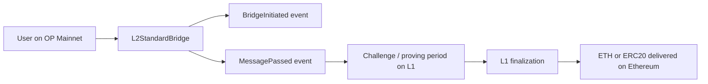

# High-Value Event-Query Targets for EVM Contract Analytics

## Executive summary

The strongest commercial targets for an event-indexing system are contracts whose storage holds user- or object-specific state behind mappings, while their emitted events reveal the full key set and the deltas needed to rebuild that state. In the highest-confidence cases below, the event stream is rich enough to reconstruct things that are difficult or impossible to enumerate from ordinary contract calls: token holder sets and blacklist state for USDC, LP range concentration and fee realization in Uniswap V3, borrower/liquidator behavior in Aave V3, share-based ownership changes in stETH despite rebases, withdrawal queue backlog and claimability in Lido, strategy allocation drift inside Yearn V3 vaults, order-fill and cancellation intelligence in Seaport, oracle-operator and update-quality changes in Chainlink OCR feeds, and bridge flow / pending-withdrawal pipelines on Optimism.

A practical conclusion for product design is that this tool should prioritize contracts where events behave like append-only ledgers, and where the main business value comes from rebuilding non-enumerable state: concentrations, exposures, lifecycle state, governance / control-surface changes, and large operational flows. The cases below are ordered by how directly they support trading, risk, treasury, compliance, analytics, or operational alerting.

## Address shortlist

The following deployed contracts are the most attractive concrete starting points for a first production rollout of an event-query system:

- **Circle USDC on Ethereum mainnet** — `0xA0b86991c6218b36c1d19D4a2e9Eb0cE3606eB48` ([Etherscan](https://etherscan.io/address/0xA0b86991c6218b36c1d19D4a2e9Eb0cE3606eB48)).
- **Uniswap V3 USDC/WETH 0.05% pool on Ethereum mainnet** — `0x88e6A0c2dDD26FEEb64F039a2c41296FcB3f5640` ([Etherscan](https://etherscan.io/address/0x88e6A0c2dDD26FEEb64F039a2c41296FcB3f5640)).
- **Aave V3 Pool on Ethereum mainnet** — `0x87870Bca3F3fD6335C3F4ce8392D69350B4fA4E2` ([Etherscan](https://etherscan.io/address/0x87870Bca3F3fD6335C3F4ce8392D69350B4fA4E2)).
- **Lido stETH core token on Ethereum mainnet** — `0xae7ab96520DE3A18E5e111B5EaAb095312D7fE84` ([Lido docs](https://docs.lido.fi/deployed-contracts/), [Etherscan](https://etherscan.io/address/0xae7ab96520DE3A18E5e111B5EaAb095312D7fE84)).
- **Lido WithdrawalQueueERC721 on Ethereum mainnet** — `0x889edC2eDab5f40e902b864aD4d7AdE8E412F9B1` ([Lido docs](https://docs.lido.fi/deployed-contracts/), [Etherscan](https://etherscan.io/address/0x889edC2eDab5f40e902b864aD4d7AdE8E412F9B1)).
- **Yearn V3 Morpho Yearn OG USDC Compounder on Ethereum mainnet** — `0x0e297dE4005883C757c9F09fdF7cF1363C20e626` ([Yearn official vault page](https://yearn.fi/v3/1/0x0e297dE4005883C757c9F09fdF7cF1363C20e626)).
- **Seaport 1.5 canonical cross-chain deployment** — `0x00000000000000ADc04C56Bf30aC9d3c0aAF14dC` ([OpenSea changelog](https://docs.opensea.io/changelog/seaport-1-5-release)).
- **Chainlink ETH/USD OCR aggregator on Ethereum mainnet** — `0xF79D6aFBb6dA890132F9D7c355e3015f15F3406F` ([Etherscan](https://etherscan.io/address/0xF79D6aFBb6dA890132F9D7c355e3015f15F3406F)).
- **Optimism L2 Standard Bridge on OP Mainnet** — `0x4200000000000000000000000000000000000010` ([Optimism spec / docs](https://sambacha.github.io/op-specs/protocol/bridges.html), [OP address docs](https://docs.optimism.io/op-mainnet/network-information/op-addresses)).

## High-priority use cases

### USDC issuer, blacklist, and holder-state monitoring

**Actionable insight.** Circle’s USDC contract is a strong event-ledger target because the event stream exposes minting, burning, blacklist changes, and pausing, while ordinary calls do not give a global, historically ordered view of the affected addresses or their transitions. That lets an event-query tool rebuild holder sets, mint/burn flows by minter, blacklist membership history, and operational control-surface events in a way that is commercially useful for compliance, exchange risk, treasury monitoring, and depeg / redemption-flow analysis.

**Chain and address.** Ethereum mainnet — `0xA0b86991c6218b36c1d19D4a2e9Eb0cE3606eB48` ([Etherscan](https://etherscan.io/address/0xA0b86991c6218b36c1d19D4a2e9Eb0cE3606eB48)). Etherscan identifies the token as a proxy using Circle’s FiatToken implementation pattern.

**Contract and role.** Circle USDC token proxy implementing the FiatToken design: ERC-20 transfers plus issuer controls for mint, burn, blacklist, and pause.

**Key events.** `Transfer(address indexed from, address indexed to, uint256 value)`, `Mint(address indexed minter, address indexed to, uint256 amount)`, `Burn(address indexed burner, uint256 amount)`, `Blacklist(address indexed account)`, `UnBlacklist(address indexed account)`, `Pause()`, and `Unpause()`. Circle’s token-design documentation explicitly ties minting, burning, blacklisting, and pausing to those emitted events.

**What an event-query can answer.**
1. Which wallets or exchanges received the largest net USDC inflows from fresh mint activity in the last 7, 30, or 90 days?
2. Which minter addresses are currently the biggest net issuers or redeemers, and how concentrated is issuance?
3. Which addresses were newly blacklisted or unblacklisted, and what balances or counterparties were attached to them before the change?
4. Which addresses accumulated large USDC balances without ever redeeming, and how concentrated is the current holder base?
5. Which entities continued receiving heavy inbound transfers shortly before a pause, blacklist, or issuer-control action?
6. Which venues or market makers are the biggest net sinks or sources of onchain USDC liquidity over a given interval?

**Decoding, post-processing, and limitations.** Rebuilding live balances is straightforward from `Transfer`; issuer-control state requires the non-ERC20 events. Proxy upgrades are a real operational risk, so production monitoring should track proxy implementation changes alongside token events. Mints and burns often need semantic labeling of issuer / treasury / exchange wallets to separate user demand from internal issuer operations. Example explorer links: [USDC contract page](https://etherscan.io/address/0xA0b86991c6218b36c1d19D4a2e9Eb0cE3606eB48) and [USDC token tracker](https://etherscan.io/token/0xa0b86991c6218b36c1d19d4a2e9eb0ce3606eb48).

### Uniswap V3 LP concentration and fee-realization intelligence

**Actionable insight.** Uniswap V3 pools hide their economically important state behind position ranges and NFTs, but the pool’s own events expose the position owner, tick range, liquidity delta, realized fee withdrawal, and swap-time price / tick. This makes the event stream ideal for reconstructing active LP concentration by range, just-in-time LP behavior, fee harvesting by owner, banded liquidity around the current price, and concentration risk that is not obvious from simple pool TVL reads.

**Chain and address.** Ethereum mainnet — `0x88e6A0c2dDD26FEEb64F039a2c41296FcB3f5640` ([Etherscan](https://etherscan.io/address/0x88e6A0c2dDD26FEEb64F039a2c41296FcB3f5640)). This is the canonical USDC/WETH 0.05% Uniswap V3 pool.

**Contract and role.** Uniswap V3 Pool for USDC/WETH 0.05% fee tier.

**Key events.** `Mint(address sender, address indexed owner, int24 indexed tickLower, int24 indexed tickUpper, uint128 amount, uint256 amount0, uint256 amount1)`, `Burn(address indexed owner, int24 indexed tickLower, int24 indexed tickUpper, uint128 amount, uint256 amount0, uint256 amount1)`, `Collect(address indexed owner, address recipient, int24 indexed tickLower, int24 indexed tickUpper, uint128 amount0, uint128 amount1)`, and `Swap(address indexed sender, address indexed recipient, int256 amount0, int256 amount1, uint160 sqrtPriceX96, uint128 liquidity, int24 tick)`.

**What an event-query can answer.**
1. Which wallets currently control the largest active liquidity near the prevailing tick?
2. Which LPs are repeatedly minting minutes before large swaps and burning immediately after, suggesting JIT liquidity behavior?
3. Which ranges or tick bands have lost the most liquidity in the last day or week?
4. Which owners have realized the highest fees through `Collect`, and how persistent is that fee edge?
5. How concentrated is liquidity within the top 5, 10, or 20 LP owners for the active price neighborhood?
6. Which large swaps caused the biggest instantaneous migration of LP inventory or fee extraction patterns?

**Decoding, post-processing, and limitations.** You need tick math and `sqrtPriceX96` normalization to convert emitted values into human price bands. The pool events identify the position owner and tick range, but if the owner is the NonfungiblePositionManager or another contract, beneficial-owner mapping may require additional joins. Example history links: [Mint example tx](https://etherscan.io/tx/0xcb2a2034f3465267f377d48bdc6c0dd0a1be210963abb2408869e917d83bba51) and [Swap example tx](https://etherscan.io/tx/0x7cd85499cfc45393a9582b6903883259258b9498042dbd8ae52606dcab68fb06).

### Aave V3 borrower, liquidator, and reserve-stress analytics

**Actionable insight.** Aave’s Pool emits user-flow events for supply, borrow, repay, withdraw, liquidation, flash loans, and user eMode changes. Those events do not by themselves replace exact indexed balance math, but they do reveal the full historical key set of active borrowers, suppliers, liquidators, and reserve-specific stress episodes, which is highly valuable for credit/risk analytics, borrower cohorting, liquidator intelligence, and reserve-level activity monitoring.

**Chain and address.** Ethereum mainnet — `0x87870Bca3F3fD6335C3F4ce8392D69350B4fA4E2` ([Etherscan](https://etherscan.io/address/0x87870Bca3F3fD6335C3F4ce8392D69350B4fA4E2)).

**Contract and role.** Aave V3 Pool, the main user-facing contract for supplying, borrowing, repaying, withdrawing, liquidating, and flash loans.

**Key events.** `Supply(address indexed reserve, address user, address indexed onBehalfOf, uint256 amount, uint16 indexed referralCode)`, `Withdraw(address indexed reserve, address indexed user, address indexed to, uint256 amount)`, `Borrow(address indexed reserve, address user, address indexed onBehalfOf, uint256 amount, InterestRateMode interestRateMode, uint256 borrowRate, uint16 indexed referralCode)`, `Repay(address indexed reserve, address indexed user, address indexed repayer, uint256 amount, bool useATokens)`, `LiquidationCall(address indexed collateralAsset, address indexed debtAsset, address indexed user, uint256 debtToCover, uint256 liquidatedCollateralAmount, address liquidator, bool receiveAToken)`, `UserEModeSet(address indexed user, uint8 categoryId)`, and `ReserveDataUpdated(...)`.

**What an event-query can answer.**
1. Which wallets opened the largest new borrow exposures by asset in the last 24 hours or 30 days?
2. Which borrowers are repeatedly refinancing, repaying, and re-borrowing in patterns consistent with leverage loops?
3. Which liquidators dominate specific collateral / debt pairs, and where is liquidation activity clustering?
4. Which reserves show the fastest acceleration in borrow demand or flash-loan activity?
5. Which addresses entered eMode recently and then expanded borrow aggressively?
6. Which exchanges, routers, or smart accounts are the biggest borrowers on behalf of other wallets?

**Decoding, post-processing, and limitations.** Exact current debt and supply balances require index math and, in many cases, companion event streams from aTokens and debt tokens; Pool events are best for flows, cohorts, and lifecycle transitions rather than exact real-time account health. Multi-asset exposure analytics also need oracle-price normalization and reserve-configuration joins. Example history links: [Withdraw example tx](https://etherscan.io/tx/0xa9a7118b55a51efa81b6ffd3f8c01677cc69e7b71ff3556d156198203c1c3a4a) and [Flash loan example tx](https://etherscan.io/tx/0xc4c4ff581a4fbf2372b5c22198df79733902225467ffcbec4903528d04a3fd4a).

### Lido stETH share-ledger and whale-accumulation monitoring

**Actionable insight.** stETH is unusually valuable for event-sourced analytics because the economically relevant unit is the share ledger, not just the rebasing token balance. Lido’s code explicitly notes that rebases do not emit `Transfer` events for every holder, but it does emit share-transfer and share-burn events. That means an event-query system can reconstruct the share ownership graph and isolate “real” accumulation, distribution, and burn activity that ordinary token-balance snapshots can blur.

**Chain and address.** Ethereum mainnet — `0xae7ab96520DE3A18E5e111B5EaAb095312D7fE84` ([Lido docs](https://docs.lido.fi/deployed-contracts/), [Etherscan](https://etherscan.io/address/0xae7ab96520DE3A18E5e111B5EaAb095312D7fE84)).

**Contract and role.** Lido core staking pool and stETH token proxy. Lido’s documentation describes it as the core stETH token and staking pool, with rebases driven by Accounting and burns routed via Burner.

**Key events.** `Transfer(address indexed from, address indexed to, uint256 value)`, `TransferShares(address indexed from, address indexed to, uint256 sharesValue)`, and `SharesBurnt(address indexed account, uint256 preRebaseTokenAmount, uint256 postRebaseTokenAmount, uint256 sharesAmount)`. Lido’s source notes that `TransferShares` is emitted alongside ERC-20 `Transfer`, while rebases do not loop through all holders to emit transfers.

**What an event-query can answer.**
1. Which wallets are the largest net accumulators of stETH *shares* rather than just rebased balances?
2. Which smart contracts or venues are receiving the largest net share inflows from whales?
3. Which addresses have been the largest net share burners over a chosen interval?
4. Which holders are repeatedly cycling between stETH and wrappers / secondary venues in ways consistent with leverage or arbitrage?
5. How concentrated is the share base among the top holders, excluding passive balance growth from rebases?
6. Which large share transfers preceded sharp sell pressure or large withdrawal-queue submissions?

**Decoding, post-processing, and limitations.** Share accounting is essential: balances must be normalized via the live share rate if the output wants current stETH-denominated balances. Rebases do *not* emit per-holder transfer events, so an event-query product should expose a “share-mode” view by default for stETH. Example history links: [confirmed `Submit` tx on stETH](https://etherscan.io/tx/0xdd675d568540c092268d85e552e053f03760ad13af8e3fae9b5e09a302353d1a) and [stETH contract page](https://etherscan.io/address/0xae7ab96520DE3A18E5e111B5EaAb095312D7fE84).

### Lido withdrawal-queue backlog and claimability analytics

**Actionable insight.** Lido’s WithdrawalQueueERC721 is one of the clearest examples of event-ledger state reconstruction. The contract represents each withdrawal request as an NFT and emits explicit request, finalization, and claim events with request IDs and amounts. This makes it possible to rebuild the queue, map current outstanding positions, quantify the claimable-but-unclaimed backlog, and detect whales or venues that are pushing exit demand.

**Chain and address.** Ethereum mainnet — `0x889edC2eDab5f40e902b864aD4d7AdE8E412F9B1` ([Lido docs](https://docs.lido.fi/deployed-contracts/), [Etherscan](https://etherscan.io/address/0x889edC2eDab5f40e902b864aD4d7AdE8E412F9B1)).

**Contract and role.** Lido WithdrawalQueueERC721, the FIFO request queue and unstETH NFT implementation for stETH withdrawals.

**Key events.** `WithdrawalRequested(uint256 indexed requestId, address indexed requestor, address indexed owner, uint256 amountOfStETH, uint256 amountOfShares)`, `WithdrawalsFinalized(uint256 indexed from, uint256 indexed to, uint256 amountOfETHLocked, uint256 sharesToBurn, uint256 timestamp)`, and `WithdrawalClaimed(uint256 indexed requestId, address indexed owner, address indexed receiver, uint256 amountOfETH)`. The docs also explain that finalization status and claimability are tracked by request ID range.

**What an event-query can answer.**
1. Which wallets or venues created the largest withdrawal demand in the last week or month?
2. What is the current queue depth in requests, stETH, shares, and estimated ETH waiting to be claimed?
3. Which finalized requests remain unclaimed, and how old are they?
4. Which entities are repeatedly creating and then transferring withdrawal NFTs before claim?
5. How concentrated is exit demand among the largest requestors or owners?
6. When did queue finalization speed materially accelerate or slow down, and which operator episodes coincided with that change?

**Decoding, post-processing, and limitations.** Because requests are NFTs, request ownership can change after creation; production analytics should join the ERC-721 `Transfer` stream from the same contract if the goal is current owner / beneficiary state, not just original requestor state. Claimability can be reconstructed from finalization and claim events even if frontend helper calls require checkpoint hints. Example history links: [Claim Withdrawal tx](https://etherscan.io/tx/0x3df2e6c0a4a99764e1062ee7a6a1088e52513890e1adc7a7e6a92faa381d14c1) and [Withdrawal Queue contract page](https://etherscan.io/address/0x889edC2eDab5f40e902b864aD4d7AdE8E412F9B1).

### Yearn V3 vault strategy-allocation drift and realized-PnL analytics

**Actionable insight.** ERC-4626 deposit/withdraw events are table stakes; the more valuable Yearn-specific layer is that VaultV3 also emits strategy-management and debt-reporting events. Those events expose strategy additions/removals, realized gains/losses, debt reallocations, refunds, and protocol fees, which together allow an event-query system to rebuild a vault’s evolving internal capital allocation and realized manager behavior even though the current strategy set and per-strategy debt are not globally enumerable in a historical, user-friendly way from ordinary calls.

**Chain and address.** Ethereum mainnet — `0x0e297dE4005883C757c9F09fdF7cF1363C20e626` ([Yearn official vault page](https://yearn.fi/v3/1/0x0e297dE4005883C757c9F09fdF7cF1363C20e626)). The official page identifies this vault as **Morpho Yearn OG USDC Compounder**.

**Contract and role.** Yearn V3 ERC-4626 vault, designed to distribute a single asset across strategies while exposing deposit, redemption, strategy-management, and profit/loss reporting.

**Key events.** `Deposit(address indexed sender, address indexed owner, uint256 assets, uint256 shares)`, `Withdraw(address indexed sender, address indexed receiver, address indexed owner, uint256 assets, uint256 shares)`, `StrategyChanged(address indexed strategy, StrategyChangeType indexed change_type)`, `StrategyReported(address indexed strategy, uint256 gain, uint256 loss, uint256 current_debt, uint256 protocol_fees, uint256 total_fees, uint256 total_refunds)`, `DebtUpdated(address indexed strategy, uint256 current_debt, uint256 new_debt)`, and `RoleSet(address indexed account, Roles indexed role)`.

**What an event-query can answer.**
1. Which strategies inside the vault have contributed the most realized gains or losses over time?
2. When did capital rotate meaningfully between strategies, and who initiated the reallocation?
3. Which depositors were entering shortly before strong positive reports, or exiting after adverse reports?
4. How much debt was concentrated in the largest strategy at each point in time?
5. Which vault role holders changed near major reallocation or reporting episodes?
6. Which vaults or strategies appear to be consistently subsidized by refunds versus fee-positive on a realized basis?

**Decoding, post-processing, and limitations.** `StrategyChangeType` and `Roles` are enums and need ABI-aware decoding. `UpdateDefaultQueue` and related storage-management events introduce arrays, which are useful but require richer decoders than scalar-only event pipelines. Current vault share price and exact mark-to-market still need asset normalization and, in some cases, supplementary strategy reads; the event stream is strongest for *history of internal decisions and realized P&L*, not full instantaneous NAV. Example links: [official Yearn vault page](https://yearn.fi/v3/1/0x0e297dE4005883C757c9F09fdF7cF1363C20e626) and [contract address page on Etherscan](https://etherscan.io/address/0x0e297dE4005883C757c9F09fdF7cF1363C20e626).

### Seaport fill, cancellation, and seller-concentration analytics

**Actionable insight.** Seaport’s onchain event stream is valuable not because it reconstructs the full open order book by itself, but because it captures the economically important lifecycle transitions: fulfillment, explicit validation, cancellation, and global counter invalidation. Those events expose fill intensity, cancellation waves, seller / zone concentration, sweep behavior, and fee-recipient patterns.

**Chain and address.** Ethereum mainnet — Seaport 1.5 canonical cross-chain deployment `0x00000000000000ADc04C56Bf30aC9d3c0aAF14dC` ([OpenSea changelog](https://docs.opensea.io/changelog/seaport-1-5-release)). OpenSea later introduced Seaport 1.6, so production coverage should consider version fragmentation.

**Contract and role.** Seaport marketplace protocol contract used for NFT and mixed-asset order fulfillment. OpenSea describes Seaport as the protocol it uses for offer and order submission / fulfillment, while continuously listening to and storing Seaport events.

**Key events.** `OrderFulfilled(bytes32 orderHash, address offerer, address zone, address recipient, SpentItem[] offer, ReceivedItem[] consideration)`, `OrderCancelled(bytes32 orderHash, address offerer, address zone)`, `OrderValidated(bytes32 orderHash, address offerer, address zone)`, and `CounterIncremented(uint256 newCounter, address offerer)`.

**What an event-query can answer.**
1. Which sellers, MM wallets, or NFT funds generated the most fill volume by collection or time window?
2. Which offerers triggered the largest cancellation waves, either directly or via counter increments?
3. Which zones are associated with the highest cancellation rates, validation rates, or fill-through rates?
4. Which buyers or routers are sweeping many small orders versus filling a few large orders?
5. Which collections or counterparties show the fastest change in fill velocity after major announcements?
6. Which fulfilled orders carried the largest total consideration or the most unusual recipient split patterns?

**Decoding, post-processing, and limitations.** `OrderFulfilled` contains array-valued `offer` and `consideration` structs, so a mature decoder must flatten nested array fields. Reconstructing *all currently open orders* still requires offchain signed-order inventory or API / orderbook inputs; onchain events alone are strongest for lifecycle transitions and executed activity. Example links: [OpenSea Seaport events docs](https://docs.opensea.io/docs/seaport-events-and-errors) and [Seaport 1.5 address page](https://etherscan.io/address/0x00000000000000ADc04C56Bf30aC9d3c0aAF14dC).

### Chainlink OCR feed-operator and update-quality monitoring

**Actionable insight.** Event-query analytics are especially strong for Chainlink OCR feeds because the underlying aggregator emits configuration changes and full transmission metadata, including the specific transmitter and per-report observation set. This makes it possible to rebuild oracle-set history, detect operator churn, measure heartbeat consistency, spot stale periods, and flag unusual dispersion in observations — all of which are difficult to derive from consumer-facing proxy reads alone.

**Chain and address.** Ethereum mainnet — `0xF79D6aFBb6dA890132F9D7c355e3015f15F3406F` ([Etherscan](https://etherscan.io/address/0xF79D6aFBb6dA890132F9D7c355e3015f15F3406F)), labeled by Etherscan as **Chainlink: ETH / USD Aggregator**. Chainlink’s docs explain that consumers typically use a proxy address, while advanced users can inspect the underlying `AccessControlledOffchainAggregator`.

**Contract and role.** Underlying OCR aggregator contract for the ETH/USD data feed, not just the consumer-facing proxy.

**Key events.** `ConfigSet(uint32 previousConfigBlockNumber, uint64 configCount, address[] signers, address[] transmitters, uint8 threshold, uint64 encodedConfigVersion, bytes encoded)` and `NewTransmission(uint32 indexed aggregatorRoundId, int192 answer, address transmitter, int192[] observations, bytes observers, bytes32 rawReportContext)`. Chainlink’s aggregator docs also emphasize that feeds may differ and that users should inspect the actual aggregator type and version.

**What an event-query can answer.**
1. When did the oracle set or threshold materially change, and which signers/transmitters were added or removed?
2. Which transmitters submit the most reports, and has transmitter concentration shifted recently?
3. Which feeds or periods exhibited stale updates relative to expected cadence?
4. Which transmissions showed unusually wide observation dispersion, suggesting elevated source disagreement?
5. Which config changes most closely preceded changes in update cadence or answer stability?
6. Which counterparties or protocols would have been exposed to the largest stale-price windows during a feed outage?

**Decoding, post-processing, and limitations.** Arrays are core to OCR events: `signers`, `transmitters`, and `observations` all need flattening. Feed answers also require decimal normalization, and operationally you often need to track both proxy and underlying aggregator because proxies may rotate to new aggregators. Example links: [recent transmit tx on the ETH/USD feed proxy page](https://etherscan.io/tx/0x050a5e443d0a521e483654bb1c44bc905fb78316cb395403d2ed4b8f23c7fb27) and [ETH/USD aggregator page](https://etherscan.io/address/0xF79D6aFBb6dA890132F9D7c355e3015f15F3406F).

### Optimism bridge-flow and pending-withdrawal backlog monitoring

**Actionable insight.** Bridge contracts are excellent event-ledger targets because they materialize cross-domain flow that is otherwise awkward to enumerate from storage. On Optimism, the Standard Bridge emits initiation and finalization events for ETH and ERC-20 transfers, while the withdrawal system’s `MessagePassed` event captures the full L2-to-L1 withdrawal payload and hash. This supports useful analytics around pending exits, bridge concentration, operational backlogs, and large cross-domain movements.

**Chain and address.** OP Mainnet primary bridge surface — `0x4200000000000000000000000000000000000010` ([bridge spec](https://sambacha.github.io/op-specs/protocol/bridges.html), [OP address docs](https://docs.optimism.io/op-mainnet/network-information/op-addresses)). The Standard Bridge is the canonical token-bridging system on OP Mainnet.

**Contract and role.** L2StandardBridge predeploy, the OP Stack bridge interface for moving ETH and ERC-20s between Ethereum and OP Mainnet. Companion withdrawal-state semantics come from `L2ToL1MessagePasser`, whose `MessagePassed` event includes the hashed and stored withdrawal payload.

**Key events.** `ERC20BridgeInitiated(address indexed localToken, address indexed remoteToken, address indexed from, address to, uint256 amount, bytes extraData)`, `ERC20BridgeFinalized(...)`, `ETHBridgeInitiated(address indexed from, address indexed to, uint256 amount, bytes extraData)`, `ETHBridgeFinalized(...)`, and `MessagePassed(uint256 indexed nonce, address indexed sender, address indexed target, uint256 value, uint256 gasLimit, bytes data, bytes32 withdrawalHash)`.

**What an event-query can answer.**
1. Which wallets initiated the largest net withdrawals from OP Mainnet over the last day, week, or month?
2. Which tokens show the largest pending outbound backlog that has been initiated but not yet finalized?
3. Which bridge counterparties are the most concentrated senders or recipients by token?
4. Which periods saw abnormal surges in `MessagePassed` withdrawals relative to normal baseline?
5. Which smart contracts are using arbitrary message passing rather than plain token bridging, and at what scale?
6. Which large withdrawal payloads or token exits may merit treasury or risk alerting before they finalize on Ethereum?

**Decoding, post-processing, and limitations.** Full end-to-end status is cross-chain by definition: an OP-side event query gives you initiated flow and, with `MessagePassed`, the precise withdrawal payload, but proving/finalization state needs corresponding L1 joins. Message payload decoding also matters for arbitrary-call withdrawals. Example links: [Optimism bridge guide](https://docs.optimism.io/app-developers/guides/bridging/standard-bridge) and [OP Mainnet contract-address page](https://docs.optimism.io/op-mainnet/network-information/op-addresses).

## Backlog

The following are also high-value, but I would treat them as a second-pass backlog because they either require more custom decoding, more cross-contract joins, or more careful version / deployment selection:

**GMX V2 order and position lifecycle on Arbitrum.** GMX’s design is excellent for event-query systems because it centralizes protocol actions in a single `EventEmitter` and uses structured `EventLog`, `EventLog1`, and `EventLog2` signatures keyed by `eventName`; the docs explicitly say this lets users monitor protocol actions without tracking every upgraded logic contract address. The custom schema is also the main challenge: it carries typed key-value payloads and arrays, so implementation quality depends on a robust decoder / flattener. GMX’s docs and source show concrete event payloads for `OrderCreated`, `OrderExecuted`, `OrderCancelled`, and related fields like `account`, `market`, `initialCollateralToken`, `sizeDeltaUsd`, and `swapPath`.

**Aave ACLManager privilege-drift monitoring.** Aave’s ACLManager is the central role registry for governance-sensitive permissions, and the implementation is based on role-based access control with distinct admin roles such as `POOL_ADMIN_ROLE`, `EMERGENCY_ADMIN_ROLE`, `RISK_ADMIN_ROLE`, `FLASH_BORROWER_ROLE`, `BRIDGE_ROLE`, and `ASSET_LISTING_ADMIN_ROLE`. This is a strong target for alerting on privilege changes, privileged actor concentration, and emergency-control drift. On Ethereum mainnet, Etherscan identifies the ACL Manager V3 at `0xc2aacf6553d20d1e9d78e365aaba8032af9c85b0`.

**Upgradeable proxy monitoring for major protocols.** Proxy layers are a distinct operational intelligence surface. Etherscan identifies both USDC and Aave contracts as proxies and surfaces implementation history / current implementation data, which makes “who upgraded what, when, and after which governance action” a natural event-query product line even when the business logic lives elsewhere.

**Seaport 1.6 version coverage.** OpenSea introduced Seaport 1.6, so a production marketplace analytics stack should version-segment 1.5 and 1.6 activity rather than assume a single canonical deployment forever.

## Open questions and practical limitations

Some of the highest-value outputs above are not pure “single-contract scalar aggregation”; they require explicit support for arrays, enums, and cross-contract joins.

For **Lido stETH**, the most meaningful state is share-based, not rebased token-balance-based, because rebases do not emit per-holder transfers. For **Yearn V3** and **Seaport**, arrays and rich structs matter materially: withdrawal-queue ownership needs ERC-721 transfers; Seaport fulfillment needs nested array flattening; Yearn’s queue / role / strategy updates include enums and sometimes arrays. For **Chainlink OCR**, the most valuable operator-intelligence signals are exactly the array fields (`signers`, `transmitters`, `observations`). For **Optimism bridges**, full withdrawal state is cross-chain and needs L1/L2 correlation.

The practical product implication is that the event-query engine should support more than simple scalar aggregation. The minimum “advanced mode” needed for the best commercial use cases is: array item explosion, enum decoding, composite key grouping, joinable metadata across multiple event types and companion contracts, optional price normalization, and proxy-aware monitoring. Without those features, the tool will still be useful, but it will leave substantial value on the table in the most interesting protocols.
